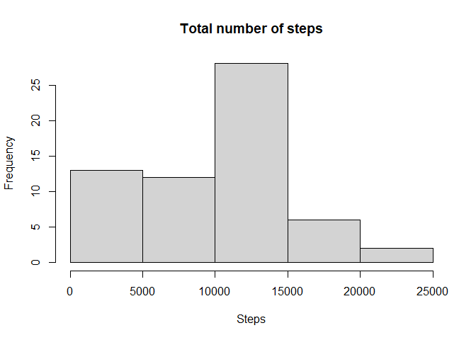
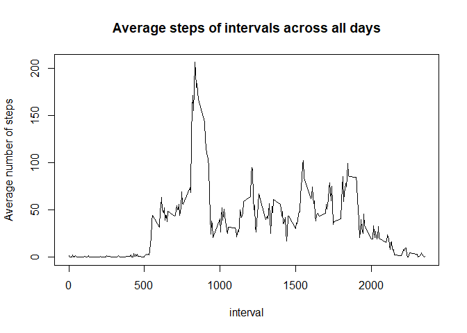
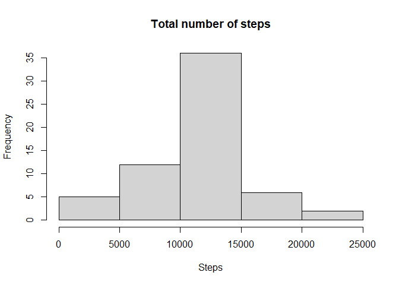
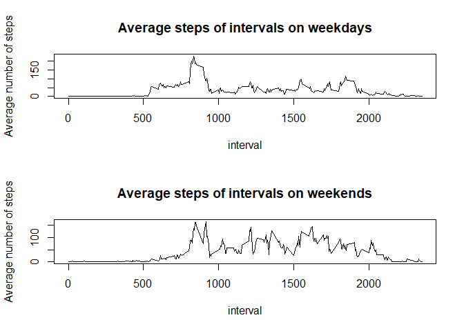

## Loading necessary packages


```r
library(plyr)
```

## Loading and preprocessing the data

1. Load the data (i.e. read.csv())


```r
unzip("activity.zip")
```

2. Process/transform the data (if necessary) into a format suitable for your analysis


```r
activity <- read.csv("activity.csv",na.strings = "NA")
activity$date <- as.Date(activity$date,"%Y-%m-%d")
```

## What is mean total number of steps taken per day?

1. Make a histogram of the total number of steps taken each day


```r
sum_step <- ddply(activity,~date,summarise,sum_step = sum(steps,na.rm = T))
with(sum_step,hist(sum_step,xlab = "Steps",main = "Total number of steps"))
```

<!-- -->

2. Calculate and report the mean and median total number of steps taken per day


```r
mean_step <- mean(sum_step$sum_step,na.rm = T)
median_step <- median(sum_step$sum_step,na.rm = T)
```

The mean total number of steps taken per day is 9354.2295082  
The median total number of steps taken per day is 10395

## What is the average daily activity pattern?

1. Make a time series plot (i.e. type = "l") of the 5-minute interval (x-axis) and the average number of steps taken, averaged across all days (y-axis)


```r
step_int <- ddply(activity,~interval,summarise, mean_int= mean(steps,na.rm = T))
with(step_int,plot(interval,mean_int, type = "l",ylab = "Average number of steps", main = "Average steps of intervals across all days"))
```

<!-- -->

2. Which 5-minute interval, on average across all the days in the dataset, contains the maximum number of steps?


```r
int_max <- step_int[which(step_int$mean_int==max(step_int$mean_int)),1]
int_max_num <- row.names(step_int[which(step_int$mean_int==max(step_int$mean_int)),])
```

The $104^{th}$ 5-minute interval, specifically, interval 835 on average contains the maximum number of steps across all the days in the dataset.

## Imputing missing values

1. Calculate and report the total number of missing values in the dataset (i.e. the total number of rows with NAs)


```r
nacases <- activity[!complete.cases(activity),]
na_num <- nrow(nacases)
```
The total number of missing values in the dataset is 2304.

2. Devise a strategy for filling in all of the missing values in the dataset. 


```r
nacases <- merge(nacases,step_int,by = "interval")
nacases_sub <- data.frame(steps = nacases$mean_int, date = nacases$date, interval = nacases$interval)
```

3.Create a new dataset that is equal to the original dataset but with the missing data filled in.


```r
activity_sub <- rbind(activity[complete.cases(activity),],nacases_sub)
```

3. Make a histogram of the total number of steps taken each day and Calculate and report the mean and median total number of steps taken per day. Do these values differ from the estimates from the first part of the assignment? What is the impact of imputing missing data on the estimates of the total daily number of steps?


```r
sum_step_sub <- ddply(activity_sub,~date,summarise,sum_step = sum(steps,na.rm = T))
with(sum_step_sub,hist(sum_step,xlab = "Steps",main = "Total number of steps"))
```

<!-- -->

```r
mean_step_sub <- mean(sum_step_sub$sum_step,na.rm = T)
median_step_sub <- median(sum_step_sub$sum_step,na.rm = T)
```

The mean total number of steps taken per day after data imputation is 1.0766189\times 10^{4}  
The median total number of steps taken per day after data imputation is 1.0766189\times 10^{4}

## Are there differences in activity patterns between weekdays and weekends?


```r
activity_sub$weekdat <- weekdays(activity_sub$date)
weekday <- c("Monday","Tuesday","Wednesday","Thursday","Friday")
weekend <- c("Saturday","Sunday")
activity_sub_wd <- subset(activity_sub, weekdat %in% weekday)
activity_sub_we <- subset(activity_sub, weekdat %in% weekend)
step_int_wd <- ddply(activity_sub_wd,~interval,summarise, mean_int= mean(steps,na.rm = T))
step_int_we <- ddply(activity_sub_we,~interval,summarise, mean_int= mean(steps,na.rm = T))
par(mfrow = c(2,1))
with(step_int_wd,plot(interval,mean_int, type = "l",ylab = "Average number of steps", main = "Average steps of intervals on weekdays"))
with(step_int_we,plot(interval,mean_int, type = "l",ylab = "Average number of steps", main = "Average steps of intervals on weekends"))
```

<!-- -->
